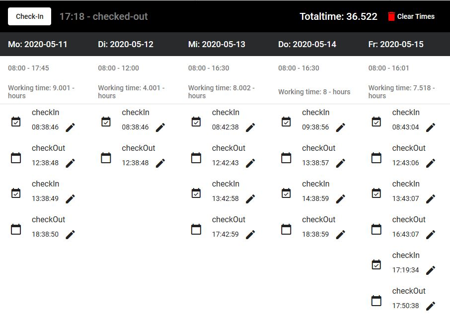

# Work time tracker

This app stores times in the local storage of the Browser and calculate working time for days.

**Used Techniques**
- [angular](https://github.com/angular/angular)
- [Angular Material](https://material.angular.io/)
- [luxon js](https://moment.github.io/luxon/docs/manual/tour.html#creating-a-datetime)
- [localStorage](https://developer.mozilla.org/en-US/docs/Web/API/Window/localStorage)
- [FileReader API](https://developer.mozilla.org/de/docs/Web/API/FileReader)
- [file-saver](https://github.com/eligrey/FileSaver.js)

**load file**
- https://developer.mozilla.org/en-US/docs/Web/API/DataTransfer
- paste string in form
- https://developer.mozilla.org/de/docs/Web/API/File/Zugriff_auf_Dateien_von_Webapplikationen
- https://developer.mozilla.org/de/docs/Web/API/FileReader
- https://www.npmjs.com/package/@tanker/file-reader
- https://www.npmjs.com/package/promise-json-file-reader
- https://developer.mozilla.org/en-US/docs/Web/API/FileReader/readAsText

## TODO: check for better storage (https://web.dev/storage-for-the-web/)
- https://github.com/dfahlander/Dexie.js

## Example

## PWA
- build with --base-href /work-time-tracker/
- set scope /work-time-tracker/
- set start_url /work-time-tracker/

## Development server

Run `ng serve` for a dev server. Navigate to `http://localhost:4200/`. The app will automatically reload if you change any of the source files.

## Code scaffolding

Run `ng generate component component-name` to generate a new component. You can also use `ng generate directive|pipe|service|class|guard|interface|enum|module`.

## Build

Run `ng build` to build the project. The build artifacts will be stored in the `dist/` directory. Use the `--prod` flag for a production build.

## Running unit tests

Run `ng test` to execute the unit tests via [Karma](https://karma-runner.github.io).

## Running end-to-end tests

Run `ng e2e` to execute the end-to-end tests via [Protractor](http://www.protractortest.org/).

## Further help

To get more help on the Angular CLI use `ng help` or go check out the [Angular CLI README](https://github.com/angular/angular-cli/blob/master/README.md).
